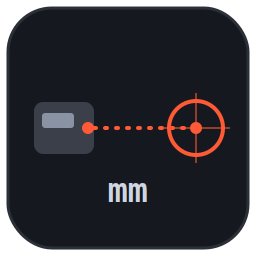

# Télémètre Bosch vers Calc



Une application Python légère qui se connecte automatiquement à un télémètre Bosch (modèles **UD 40C** / **PTM 2.0**) via Bluetooth Low Energy (BLE). L'application affiche les mesures en temps réel, les sauvegarde dans un journal CSV, et les insère dynamiquement dans la cellule sélectionnée d'une feuille LibreOffice Calc.

## ✨ Fonctionnalités

- **Connexion intelligente** : Connexion Bluetooth à la demande sans scan continu, ce qui évite les interférences avec vos autres périphériques Bluetooth (casques, souris, etc.).
- **Détection automatique** : Scanne la signature BLE du Bosch et s'y connecte sans avoir besoin de coder l'adresse MAC en dur.
- **Intégration LibreOffice Calc** : Écrit instantanément la mesure dans la cellule active et déplace le curseur vers le bas (nécessite l'API UNO).
- **Historique CSV** : Chaque mesure est horodatée et sauvegardée automatiquement dans `~/mesures_telemetre.csv`.
- **Réglages flexibles** : Choix de l'unité (Millimètres ou Mètres) et configuration de la précision (nombre de décimales) depuis l'interface.

## 🛠️ Prérequis et Portabilité

- **Système d'exploitation** : Testé sur Linux (Ubuntu/Debian). L'ordinateur doit disposer du Bluetooth.
- **LibreOffice Calc** : Pour l'insertion directe des mesures, LibreOffice doit être installé avec `python3-uno` et lancé avec un port d'écoute ouvert.
- **AppImage** : La version "portable" (sans l'intégration Calc) peut être compilée via PyInstaller. L'intégration Calc nécessite l'installation système en raison des dépendances de la bibliothèque UNO.

## 🚀 Installation (Ubuntu/Debian)

L'installation se fait simplement via le script fourni, qui se chargera d'installer les dépendances système (`python3-tk`, `python3-uno`, `pipx`) et de configurer l'application :

```bash
./install.sh
```

## 🎯 Utilisation

1. **Préparation** : Allumez le télémètre Bosch (coupez le Bluetooth de votre téléphone s'il y est habituellement connecté).
2. **Lancement avec Calc** :
   Pour démarrer LibreOffice Calc avec l'écouteur activé et lancer l'application en même temps :
   ```bash
   telemetre-calc.sh
   ```
   *(Si vous n'avez pas besoin de Calc, lancez simplement `telemetre`)*
3. **Connexion** : Cliquez sur le bouton "Connecter" dans l'application. Elle va trouver le télémètre.
4. **Mesure** : 
   - Cliquez sur la cellule de départ dans LibreOffice Calc.
   - Prenez une mesure avec le télémètre.
   - La valeur s'affiche dans l'application, s'insère dans la cellule Calc et le curseur descend automatiquement d'une case.

> 💡 **Astuce** : Vous pouvez changer de cellule dans Calc à tout moment, la prochaine mesure ira toujours dans la cellule active.

## 📦 Création d'un exécutable (AppImage)

Si vous souhaitez utiliser l'application *sans* l'intégration LibreOffice (juste l'affichage et le CSV) sur d'autres postes sans dépendances :

```bash
pip install pyinstaller
pyinstaller --onefile --name telemetre telemetre_app.py
```
*Note : Le binaire généré n'inclura pas le module `uno`.*

## 📡 Notes Techniques sur le Protocole BLE

- **Caractéristique utilisée** : `02a6c0d2-0451-4000-b000-fb3210111989`
- **Séquence d'initialisation** : `c0 55 02 01 00 1a`
- **Format de mesure** : Flottant (Little Endian, en mètres) à l'offset 7 de la trame.
- **Identification** : Basée sur l'ID constructeur (`678`), l'UUID de service (`fde8`), ou le nom du périphérique (contient "Bosch", "UniversalDistance", ou "UD 40").
